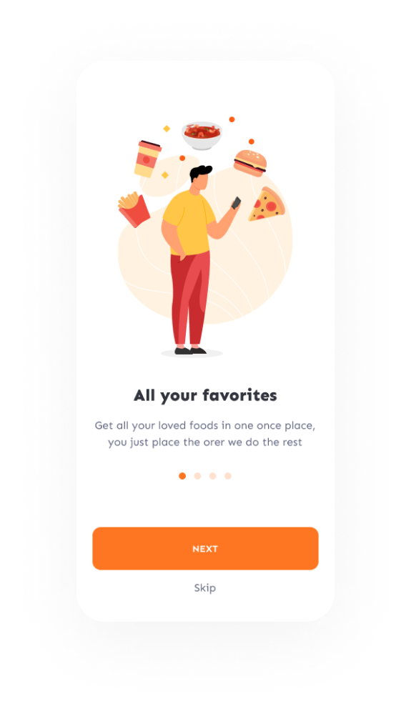
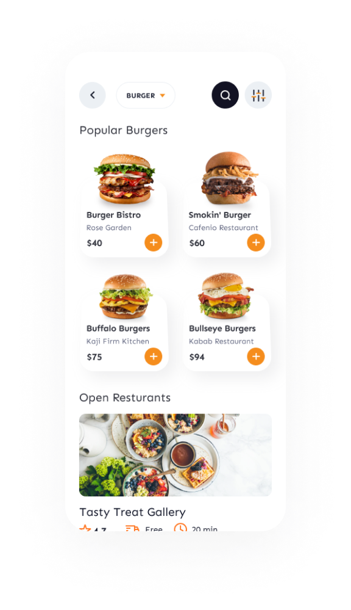
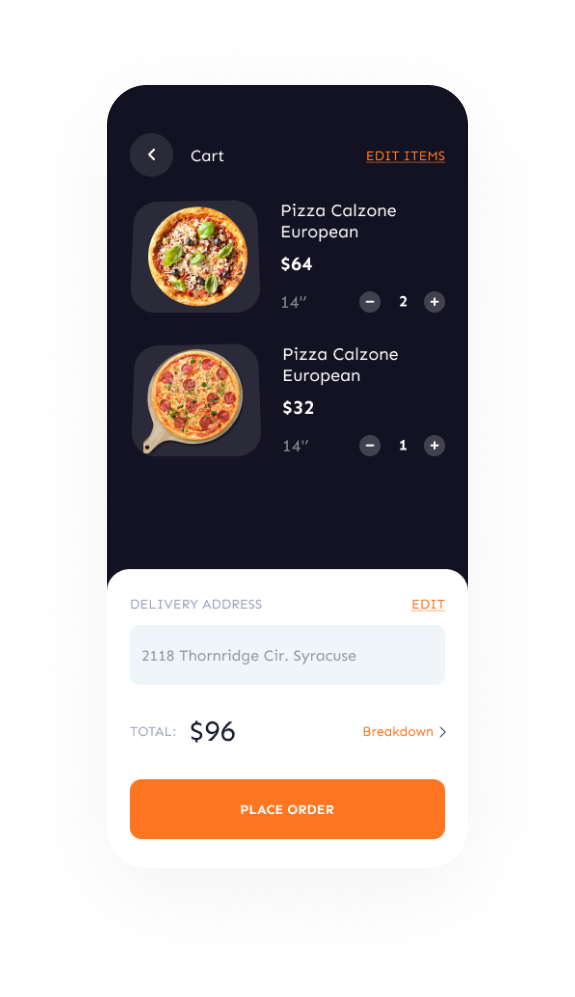
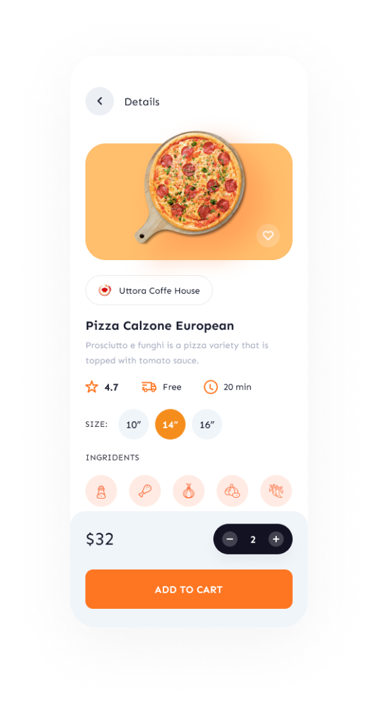

# 🍔 Food Delivery App

Seamlessly connect users with their favorite meals through cutting-edge technology and an intuitive UI.

---

## 🌟 Features
- 🌈 **User-Friendly Interface**: Designed with sleek and functional UI elements.
- ⚡ **Real-Time Updates**: Dynamically fetch data using JavaScript Fetch API.
- 🔒 **Secure Backend**: Powered by Java with Hibernate, ensuring robust database interactions.
- 💾 **Scalable Database**: Utilizes MySQL for efficient and reliable data storage.
- 📱 **Cross-Platform Experience**: Built with React Native for a seamless experience on iOS and Android.
- 🎨 **Responsive Design**: Styled using CSS for consistent visuals on all devices.

---

## 🛠️ Tech Stack
- **Frontend**: React Native, JavaScript, CSS
- **Backend**: Java (Hibernate framework)
- **Database**: MySQL
- **API Communication**: Fetch API

---

## 🎯 Key Modules
1. **User Authentication**: Sign up, log in, and secure session management.
2. **Restaurant Listing**: Browse through a curated list of restaurants.
3. **Food Categories**: Filter dishes by categories for quick navigation.
4. **Cart Management**: Add, edit, or remove items from the cart.
5. **Order Tracking**: Keep tabs on order status and estimated delivery time.
6. **Payment Integration**: Smooth checkout process with payment gateway support.

---

## 🖼️ Project Screenshots

### 1. App Info

### 2. Home Screen

### 3. Cart Management

### 4. Food Details

